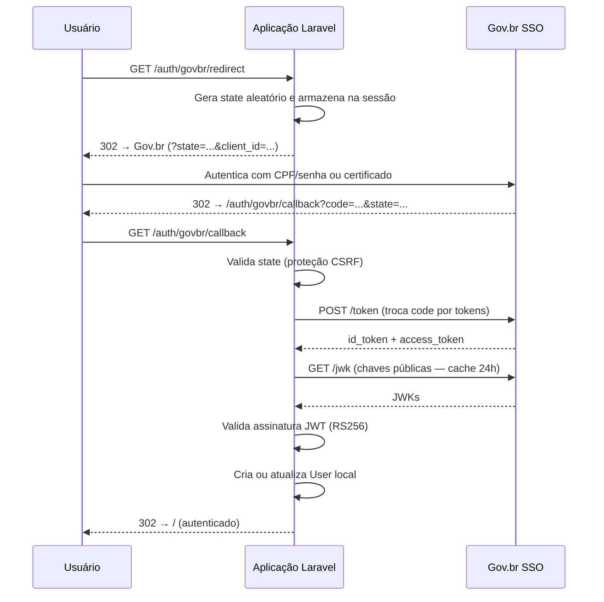

# GovBR Auth

[](https://packagist.org/packages/salexcarvalho/govbr-auth)
[](https://packagist.org/packages/salexcarvalho/govbr-auth)
[](https://laravel.com)
[](https://github.com/salexcarvalho/GovBR_Auth/actions)
[](LICENSE)

Pacote Laravel para autenticação com o **[Gov.br](https://www.gov.br/pt-br/servicos/entrar-no-gov.br)** via protocolo **OpenID Connect (OIDC)**. Integre o login unificado do governo federal brasileiro em qualquer aplicação Laravel em minutos.

---

## Sumário

- [Requisitos](#-requisitos)
- [Instalação](#-instalação)
- [Configuração](#-configuração)
- [Rotas disponíveis](#-rotas-disponíveis)
- [Protegendo rotas](#-protegendo-rotas)
- [Modelo de usuário personalizado](#-modelo-de-usuário-personalizado)
- [Tratamento de erros](#-tratamento-de-erros)
- [Fluxo de autenticação](#-fluxo-de-autenticação)
- [Testes](#-testes)
- [Contribuição](#-contribuição)
- [Changelog](#-changelog)
- [Licença](#-licença)

---

## 📦 Requisitos

| Dependência | Versão mínima |
|-------------|--------------|
| PHP | 7.4 |
| Laravel | 8.x, 9.x, 10.x, 11.x ou 12.x |
| Extensão OpenSSL | qualquer |
| GuzzleHTTP | ^7.0 |
| firebase/php-jwt | ^6.0 |

---

## 🚀 Instalação

```bash
composer require salexcarvalho/govbr-auth
```

Publique o arquivo de configuração:

```bash
php artisan vendor:publish --tag=govbr-config
```

---

## 🔧 Configuração

Defina as variáveis no seu `.env`:

```dotenv
GOVBR_CLIENT_ID=seu-client-id
GOVBR_CLIENT_SECRET=seu-client-secret
GOVBR_REDIRECT_URI=https://seu-dominio.com/auth/govbr/callback

# Endpoints do SSO Gov.br (produção)
GOVBR_AUTHZ_ENDPOINT=https://sso.acesso.gov.br/authorize
GOVBR_TOKEN_ENDPOINT=https://sso.acesso.gov.br/token
GOVBR_JWK_ENDPOINT=https://sso.acesso.gov.br/jwk
```

> **Staging (homologação):** substitua `sso.acesso.gov.br` por `sso.staging.acesso.gov.br`.

Para obter credenciais, acesse o [Portal do Desenvolvedor Gov.br](https://www.gov.br/conecta/catalogo/).

---

## 🚧 Rotas disponíveis

O pacote registra automaticamente as seguintes rotas:

| Método | URI | Nome | Descrição |
|--------|-----|------|-----------|
| `GET` | `/auth/govbr/redirect` | `govbr.login` | Redireciona o usuário para o portal Gov.br |
| `GET` | `/auth/govbr/callback` | `govbr.callback` | Recebe o código de autorização e autentica |
| `POST` | `/auth/govbr/logout` | `govbr.logout` | Encerra a sessão Gov.br |

Inicie o login com:

```blade
<a href="{{ route('govbr.login') }}">Entrar com Gov.br</a>
```

---

## 🛡️ Protegendo rotas

Use o middleware `govbr.auth` para restringir acesso a usuários autenticados via Gov.br:

```php
Route::middleware('govbr.auth')->group(function () {
    Route::get('/dashboard', DashboardController::class);
});
```

---

## 👤 Modelo de usuário personalizado

Por padrão, o pacote usa o modelo definido em `auth.providers.users.model`. Para sobrescrever, defina em `config/govbr.php` (ou via `.env`):

```dotenv
GOVBR_USER_MODEL=App\Models\Servidor
```

O modelo deve ter uma coluna `govbr_sub` (chave do usuário no Gov.br) e aceitar `name` e `email` como atributos preenchíveis:

```php
// migration
$table->string('govbr_sub')->unique()->nullable();

// Model
protected $fillable = ['name', 'email', 'govbr_sub'];
```

---

## ⚠️ Tratamento de erros

O pacote lança `GovBrAuthException` em situações de erro. Registre um handler no seu `app/Exceptions/Handler.php` para apresentar uma resposta amigável ao usuário:

```php
use Salexcarvalho\GovBrAuth\Exceptions\GovBrAuthException;

public function register(): void
{
    $this->renderable(function (GovBrAuthException $e) {
        return redirect()->route('login')
            ->withErrors(['govbr' => 'Não foi possível autenticar via Gov.br. Tente novamente.']);
    });
}
```

Situações que disparam a exceção:

| Situação | Mensagem |
|----------|---------|
| Recusa de autorização pelo usuário | `Erro de autorização Gov.br: access_denied` |
| Parâmetro `state` inválido (CSRF) | `Parâmetro state inválido.` |
| Código de autorização ausente | `Código de autorização não recebido.` |
| Falha de rede no endpoint de token | `Falha ao comunicar com o endpoint de token do Gov.br` |
| `id_token` ausente na resposta | `Resposta do token inválida: id_token ausente.` |
| JWT inválido ou expirado | `Falha na validação do id_token` |

---

## 🔄 Fluxo de autenticação



---

## 🧪 Testes

```bash
composer test
```

Para gerar relatório de cobertura:

```bash
composer test:coverage
```

---

## 🤝 Contribuição

Contribuições são bem-vindas! Por favor, leia o [CONTRIBUTING.md](CONTRIBUTING.md) antes de abrir um Pull Request.

1. Faça um fork do repositório
2. Crie sua branch: `git checkout -b feature/minha-feature`
3. Commit: `git commit -m 'feat: adiciona minha feature'`
4. Push: `git push origin feature/minha-feature`
5. Abra um Pull Request

---

## 📋 Changelog

Veja o [CHANGELOG.md](CHANGELOG.md) para o histórico de mudanças.

---

## 📝 Licença

MIT — veja o arquivo [LICENSE](LICENSE) para mais detalhes.
